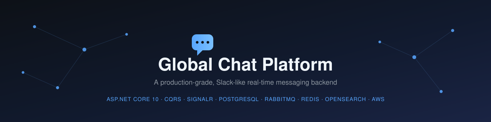

<div align="center">


### A production-grade, Slack-like real-time messaging backend

[](./LICENSE)


*Real-time messaging, channels, files, and search — built with Vertical Slice Architecture and CQRS.*

[Screenshots](#-screenshots) •
[Architecture](#-architecture-at-a-glance) •
[Features](#-features) •
[Tech Stack](#-tech-stack) •
[Getting Started](#-getting-started) •
[Project Status](#-project-status) •
[Documentation](#-documentation)

</div>

---

## 📸 Screenshots

<div align="center">

**Login / Authentication**


<br/><br/>

**Workspace — Channels & Messaging**


</div>

> These screens are early UI previews of the client, built against the API described below. Full frontend source lives in a separate repository (see [Related Repositories](#-related-repositories)).

---

## 🏗 Architecture at a Glance

This project is documented using the [C4 model](https://c4model.com) — four levels of zoom, from the big picture down to deployment. Click any diagram to view it full-size.

> 📝 **Note:** these diagrams are maintained as Mermaid source files (`.md`) inside [`docs/architecture`](docs/architecture) rather than static images, so they stay easy to diff and update in PRs. Click a card below to open the rendered diagram on GitHub.

<table>
<tr>
<td width="50%" align="center">

**1. System Context**

📄 [`context-diagram.md`](docs/architecture/context-diagram.md)

</td>
<td width="50%" align="center">

**2. Containers**

📄 [`container-diagram.md`](docs/architecture/container-diagram.md)

</td>
</tr>
<tr>
<td width="50%" align="center">

**3. Components**

📄 [`component-diagram.md`](docs/architecture/component-diagram.md)

</td>
<td width="50%" align="center">

**4. Deployment**

📄 [`deployment-diagram.md`](docs/architecture/deployment-diagram.md)

</td>
</tr>
</table>

> 📖 Each diagram includes an **MVP Status** table showing what's actually built vs. what's planned. Full write-ups live in [`docs/architecture`](docs/architecture), and the reasoning behind every major call is recorded in [`docs/architecture/decisions`](docs/architecture/decisions) as Architecture Decision Records (ADRs).

Deployment is fully GitOps-driven via [`argocd-demo`](https://github.com/abdulrahman11a/argocd-demo) — Argo CD, Terraform, Helm, and Kustomize manage the infrastructure this platform runs on.

---

## ✨ Features

- 💬 Real-time messaging via WebSockets (SignalR)
- 🗂️ Workspaces, channels, and threaded conversations
- 📎 File & media attachments
- 🔍 Full-text search across messages and files *(planned — see [Project Status](#-project-status))*
- 🔐 JWT-based authentication
- 🚦 Built-in API rate limiting
- 📈 Structured for observability (metrics, logs, tracing) as the platform grows

---

## 🧰 Tech Stack

<div align="center">

| Layer | Technology |
|---|---|
| Backend | ASP.NET Core 10 · Entity Framework Core 10 |
| Architecture | Vertical Slice Architecture · CQRS |
| Real-time | SignalR |
| Database | PostgreSQL |
| Messaging | RabbitMQ |
| Cache | Redis |
| Search | OpenSearch |
| File storage | Amazon S3 |
| Observability | OpenTelemetry |
| Deployment | Docker · Kubernetes (EKS) · Argo CD (GitOps) |

</div>

---

## 📂 Repository Structure

```
global-chat-platform/
├── src/
│   ├── <ApiProjectName>/        ← ASP.NET Core Web API (entry point)
│   ├── <ApplicationName>/       ← CQRS handlers, vertical slices, business logic
│   ├── <DomainName>/            ← Domain entities, value objects, domain events
│   └── <InfrastructureName>/    ← EF Core, external service integrations
├── tests/
│   ├── <ProjectName>.UnitTests/
│   └── <ProjectName>.IntegrationTests/
├── docs/
│   ├── architecture/            ← C4 diagrams + ADRs
│   ├── requirements/            ← Product & functional requirements
│   └── system-design/           ← Detailed design notes
├── docker-compose.yml           ← Local dependencies (Postgres, Redis, etc.)
├── .github/workflows/           ← CI pipelines
└── README.md
```

> ⚠️ **TODO:** confirm the actual folder/project names once the solution structure is finalized, and update this tree to match.

---

## 🚀 Getting Started

### Prerequisites

- [.NET 10 SDK](https://dotnet.microsoft.com/download)
- [Docker](https://www.docker.com/) & Docker Compose
- Git

### Run locally

```bash
# 1. Clone the repository
git clone https://github.com/abdulrahman11a/global-chat-platform.git
cd global-chat-platform

# 2. Start local dependencies (Postgres, Redis, etc.)
docker compose up -d

# 3. Apply database migrations
dotnet ef database update --project src/<ApiProjectName>

# 4. Run the API
dotnet run --project src/<ApiProjectName>
```

The API will be available at `https://localhost:5001` (adjust based on your `launchSettings.json`).

> ⚠️ **TODO:** replace `<ApiProjectName>` with the actual project path, and add/verify a `docker-compose.yml` at the repo root once available.

### Configuration

Configuration is provided via environment variables / `appsettings.json`. Never commit real secrets — use `appsettings.Development.json` (gitignored) or environment variables locally, and a secrets manager in deployed environments.

| Variable | Description | Example |
|---|---|---|
| `ConnectionStrings__Default` | PostgreSQL connection string | `Host=localhost;Database=chat;Username=postgres;Password=postgres` |
| `Jwt__Secret` | Secret used to sign access tokens | `your-secret-here` |
| `Jwt__Issuer` | JWT issuer | `global-chat-platform` |
| `Jwt__ExpiryMinutes` | Access token lifetime | `60` |
| `Redis__ConnectionString` | Redis connection string | `localhost:6379` |

> ⚠️ **TODO:** confirm the actual configuration keys used by the code and update this table accordingly.

### Running tests

```bash
dotnet test
```

---

## 📊 Project Status

<div align="center">

| Area | Status |
|---|:---:|
| Core messaging (single API, single DB) | ✅ In progress |
| JWT authentication (self-issued) | ✅ In progress |
| Rate limiting | 🔜 Planned for MVP |
| File & media attachments (S3) | 🔜 Planned for MVP |
| CQRS split, message broker (RabbitMQ) | 🔜 Future architecture |
| Full-text search (OpenSearch) | 🔜 Future architecture |
| Email / push notifications | 🔜 Future (in-app only for now) |
| OAuth login (Google / Facebook) | 🔜 Future architecture |
| CI/CD via `argocd-demo` | 🔜 Not yet connected |

</div>

See [`docs/architecture/decisions`](docs/architecture/decisions) for the reasoning behind each of these calls.

---

## 📚 Documentation

| Doc | Description |
|---|---|
| [`docs/architecture`](docs/architecture) | C4 diagrams (Context, Container, Component, Deployment) |
| [`docs/architecture/decisions`](docs/architecture/decisions) | Architecture Decision Records (ADRs) |
| [`docs/requirements`](docs/requirements) | Product & functional requirements *(in progress)* |
| [`docs/system-design`](docs/system-design) | Detailed system design notes *(in progress)* |
| [`docs/api`](docs/api) *(planned)* | API endpoint reference |
| [`docs/database`](docs/database) *(planned)* | Database schema documentation |

---

## 🔗 Related Repositories

| Repository | Purpose |
|---|---|
| [`argocd-demo`](https://github.com/abdulrahman11a/argocd-demo) | GitOps infrastructure — Argo CD, Terraform, Helm, Kustomize |
| Frontend client *(planned)* | React SPA consuming this API |

---

## 🗺️ Roadmap

- [x] Define MVP scope and architecture (Context, Container, Component, Deployment)
- [x] Document key architectural decisions (ADRs)
- [ ] Database schema design
- [ ] Core API endpoints (Auth, Workspaces, Channels, Messages)
- [ ] Real-time messaging via SignalR
- [ ] File upload support (S3)
- [ ] Rate limiting
- [ ] CI/CD integration with `argocd-demo`
- [ ] Future: CQRS split, message broker, search, external notifications

---

## 🤝 Contributing

This project is currently maintained solo. Issues and suggestions are welcome via [GitHub Issues](https://github.com/abdulrahman11a/global-chat-platform/issues).

---

## 📄 License

This project is licensed under the [MIT License](./LICENSE).

---

<div align="center">

Built by **[Abdulrahman Fikry Ahmed El-Badry](https://github.com/abdulrahman11a)**

</div>
