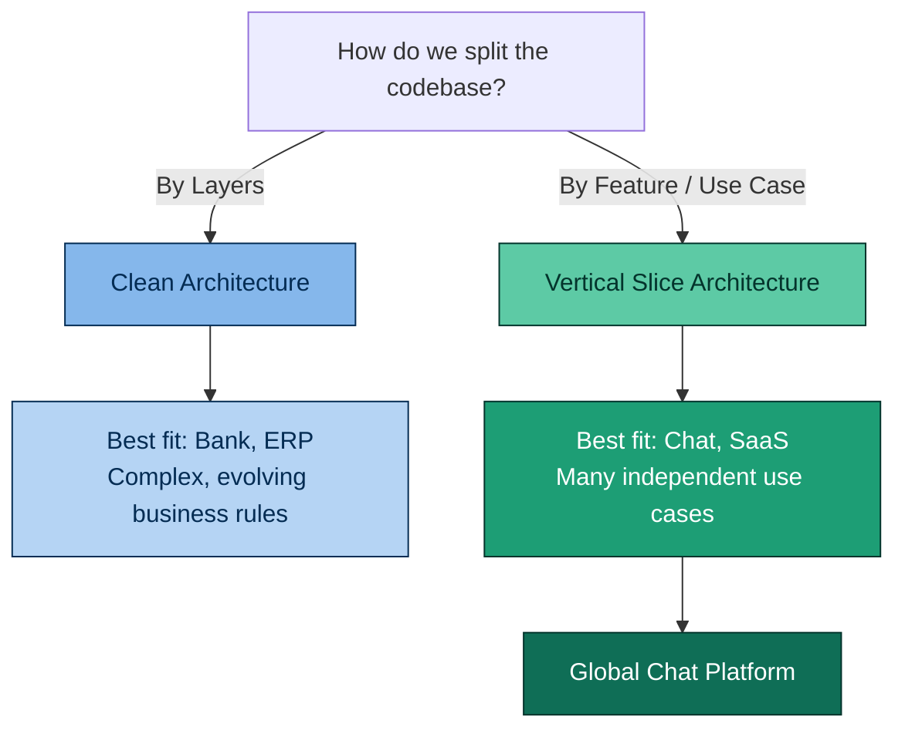
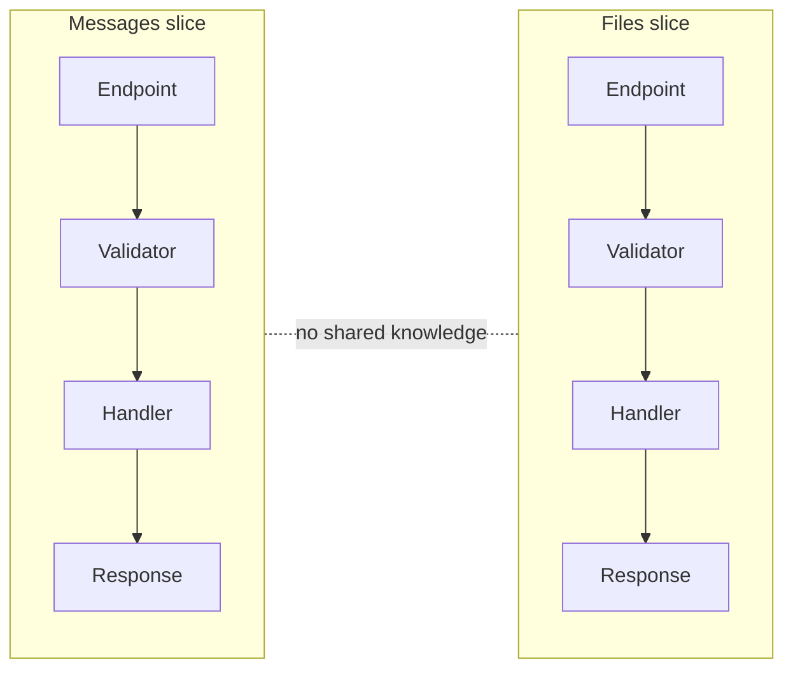

# ADR-0001: Choose Vertical Slice Architecture

  
  
  
  

Global Chat Platform — Architecture Decision Record

---

> [!NOTE]
> **TL;DR** — This project is organized around **features** (Login, Send Message, Upload File...), not around **layers** (Controllers, Services, Repositories). We chose **Vertical Slice Architecture + CQRS**, and we push logic into the domain only when a slice actually proves it needs it.

---

## 📋 Status

**Accepted**

---

## 🧭 Context

**Global Chat Platform** is a real-time messaging backend similar to Slack.

The application is composed of many independent, loosely related use cases:

| Domain area | Examples |
|---|---|
| Authentication | Login, Register |
| Workspaces | Create, Invite members |
| Channels | Create, Join, Archive |
| Messaging | Send, Edit, Delete |
| Files | Upload, Download |
| Search | Full-text search |
| Notifications | In-app, push |
| Presence | Online / offline status |

The project is expected to grow **horizontally** — by continuously adding new
features — rather than by deepening a small set of highly complex business
rules. This is the opposite growth pattern of a domain-heavy system such as a
banking or ERP platform.

### 🎯 The core question

Every architecture decision starts with one question:

> [!IMPORTANT]
> **How do we split the codebase — by layer, or by feature?**

Since this project was scoped from day one around **use cases**
(`Send Message`, `Upload File`, `Create Workspace`...) rather than around
**domain aggregates** (`Money`, `Transfer`, `Account`...), it naturally fits
the right-hand branch above.

A vertical slice cuts across every traditional layer for a single use case,
instead of forcing every use case through the same shared layers:

  
   
  <b>Figure 1</b> — Each slice (e.g. "Create a new product") owns its own path through the UI, domain, repository and database layers, instead of sharing one repository and one set of domain objects across all use cases.

---

## ✅ Decision

The project will use **Vertical Slice Architecture** combined with **CQRS**.

Each feature owns its own:
Endpoint → Request/Command/Query → Validator → Handler → Response

Features are isolated from one another to **minimize coupling** and
**maximize cohesion** — a change to `Send Message` should never require
touching `Upload File` or `Notifications`.

> [!TIP]
> Code is **not shared by default** between slices. Duplication is preferred
> until a piece of logic is proven to represent the **exact same business
> concept** in two places — not just similar-looking code.
>
> *"Duplication is far cheaper than the wrong abstraction."* — Sandi Metz

---

## 🤔 Why not Clean Architecture?

A traditional layered architecture (`API → Application → Domain →
Infrastructure`) introduces abstractions — `Repository`, `Service`,
`UnitOfWork`, `Specification` — that pay off when business rules are complex
and centered around a rich domain model.

This project is **feature-driven**, not **domain-driven**. Most use cases are
straightforward request → validate → persist → respond flows. Forcing every
feature through the same layered abstraction stack from day one would add
boilerplate without adding safety.

  
   
  <b>Figure 2</b> — A single "Use Case" slice can still pass through the Domain, Application and Infrastructure rings when needed — but the slice, not the ring, is the unit of ownership and change.

> [!IMPORTANT]
> If a specific slice's logic grows complex enough to need it (e.g. a
> `MessageDomainService` or a rich `Message` entity), that logic is pushed
> into the domain **at that point** — not preemptively. Jimmy Bogard frames
> Vertical Slice Architecture this way: start simple with a
> [Transaction Script](https://martinfowler.com/eaaCatalog/transactionScript.html),
> and only refactor toward domain patterns as code smells actually appear.

### Quick comparison

| | Clean Architecture | Vertical Slice Architecture |
|---|:---:|:---:|
| Organized by | Layer | Feature / use case |
| Best for | Complex, evolving domain rules | Many independent use cases |
| Typical fit | Banking, ERP | Chat, SaaS, CRUD-heavy apps |
| Shared abstractions | Repository, Service, UoW from day one | Added only when proven necessary |
| Our choice | ❌ | ✅ |

---

## 📊 Consequences

### Benefits

| Benefit | Why it matters here |
|---|---|
| ⚡ Faster feature development | Everything for one use case lives in one place |
| 🧩 Independent features | Teams/PRs can work on `Messages` and `Files` without conflicts |
| 🪶 Less boilerplate | No forced `Repository`/`Service` layer for simple CRUD-like slices |
| 👤 Clear ownership | One folder = one feature = one person/PR to review |
| 🚀 Easier onboarding | New devs read one slice top-to-bottom instead of jumping across layers |

### Trade-offs

> [!WARNING]
> These are the costs we're accepting in exchange for the benefits above.

| Trade-off | Mitigation |
|---|---|
| Risk of duplicated code across slices | Extract shared code only when it represents the *same* business concept |
| Requires discipline in refactoring | Revisit slices periodically; don't let duplication silently rot |
| Less "obvious" structure for devs used to layered architecture | Documented here + in `docs/architecture/architecture-overview.md` |
| Team must be comfortable with refactoring | This pattern assumes the team can recognize when logic should move into the domain |

---

## 📚 References

- Jimmy Bogard — [*Vertical Slice Architecture*](https://www.jimmybogard.com/vertical-slice-architecture/) (2018)
- Sandi Metz — *The Wrong Abstraction*
- [`docs/architecture/architecture-overview.md`](../architecture/architecture-overview.md)

---

Part of <a href="../architecture/architecture-overview.md">docs/architecture</a> · Global Chat Platform

